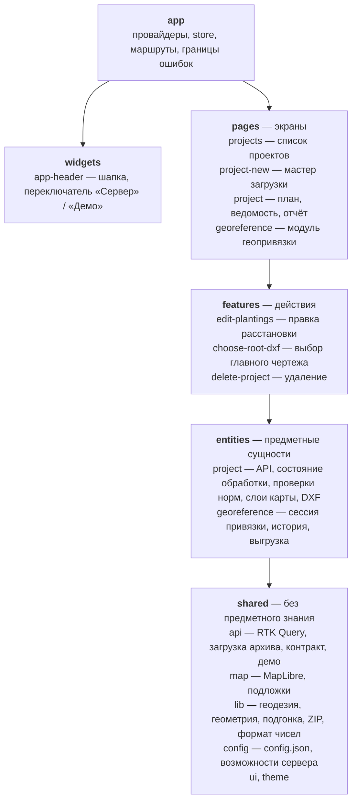
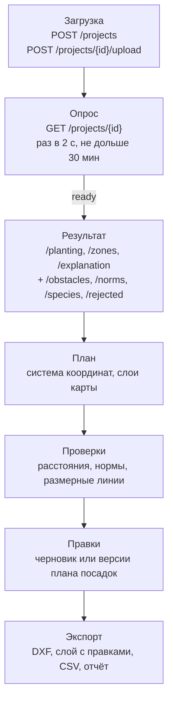
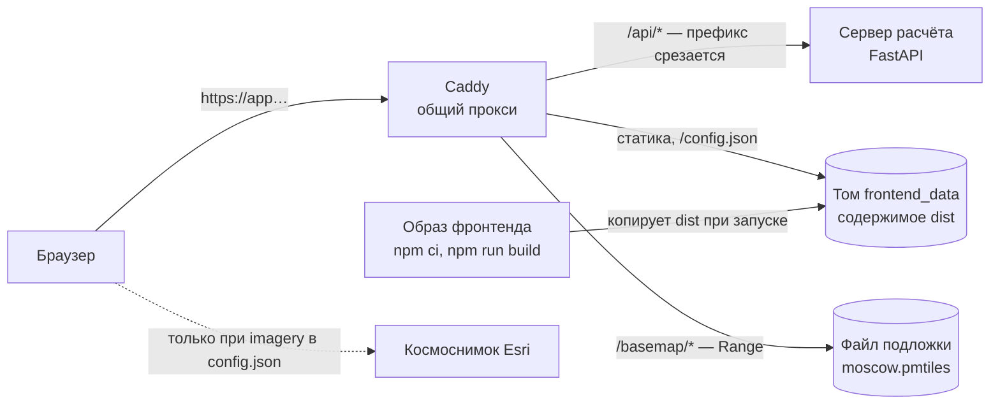

# Архитектура

Одностраничное приложение на React 19 и TypeScript, собирается Vite в статические файлы. Серверное состояние — RTK Query, клиентское (правки, сессия геопривязки) — Redux Toolkit. Карта — MapLibre GL на WebGL, подложка — файл PMTiles на своём сервере. Код разложен по слоям Feature-Sliced Design: слой импортирует только нижележащие, границы проверяет steiger.

## Компоненты

PNG для печати: [images/architecture-components.png](images/architecture-components.png).

### Слои и ключевые модули

- **`app`.** Провайдеры Mantine, Redux, роутер; маршруты грузятся лениво, у каждого — граница ошибок. До запуска приложения `main.tsx` загружает и проверяет `/config.json`; если конфиг не прошёл проверку, показывается статичный экран ошибки.
- **`widgets`.** `app-header` — шапка приложения: разделы, переключатель «Сервер» / «Демо», метка демонстрационных данных.
- **`pages`.**
  - `projects` — список проектов с карточками и превью; пока идут обработки, список опрашивается одним запросом.
  - `project-new` — мастер загрузки: описание, при необходимости область участка на карте, файлы, загрузка и обработка. Проверка архива без распаковки — `model/check-archive.ts`, упаковка отдельных DXF в ZIP — `model/pack-files.ts`.
  - `project` — экран проекта: план на карте (`ui/result-map.tsx`), панели выбранного, ведомость, скачивание DXF, отчёт для согласования (`ui/report-page.tsx`).
  - `georeference` — модуль геопривязки; открывается сам по себе или из проекта (`?project=<id>`).
- **`features`.**
  - `edit-plantings` — правки расстановки: разница с расстановкой сервиса, история, черновик в браузере или версии плана посадок на сервере.
  - `choose-root-dxf` — выбор главного чертежа, если в архиве их несколько.
  - `delete-project` — удаление проекта и правило, когда оно доступно.
- **`entities`.**
  - `project` — запросы к API, разбор состояния обработки, система координат плана (`lib/local-frame.ts`), проверки норм (`lib/planting-checks.ts`, `lib/obstacle-checks.ts`), основание норм (`lib/norm-basis.ts`), размерные линии, слои карты (`lib/result-layers.ts`), слой DXF (`lib/planting-dxf.ts`).
  - `georeference` — сессия модуля геопривязки с историей отмены, выгрузка JSON, CSV, GeoJSON с самопроверкой.
- **`shared`.**
  - `api` — единственный `createApi`, приведение ошибок к одному типу, загрузка архива через `XMLHttpRequest` с прогрессом, типы контракта (генерируются из OpenAPI), демонстрационные данные.
  - `map` — карта MapLibre, стиль подложки, протокол `pmtiles://`, космоснимок.
  - `lib/geodesy`, `lib/georeference`, `lib/contour` — геодезия, подгонка по опорным точкам, разбор контура.
  - `lib/geometry` — расстояния до многоугольников и отрезков, сеточные индексы.
  - `lib/zip` — чтение каталога ZIP без распаковки.
  - `lib/format` — числа, даты, единицы по правилам русской типографики.
  - `config` — runtime-конфиг и возможности сервера.

## Потоки данных

PNG для печати: [images/architecture-data-flow.png](images/architecture-data-flow.png).

1. **Загрузка.** Мастер создаёт проект (`POST /projects`) только на шаге загрузки и отправляет архив сырыми байтами (`POST /projects/{id}/upload`, `Content-Type: application/zip`). Ответ 202 — архив принят. Если пользователь ушёл до ответа, проект удаляется.
2. **Опрос.** Состояние обработки приходит в поле `job` проекта. Пока обработка идёт, `GET /projects/{id}` запрашивается раз в 2 секунды (`POLLING_INTERVAL_MS` в `entities/project/model/polling.ts`). Через 30 минут опрос останавливается, и пользователь видит «Проверить снова».
3. **Результат.** После `ready` загружаются `/planting`, `/zones`, `/explanation`. По списку возможностей сервера к ним добавляются `/obstacles`, `/norms`, `/species`, `/rejected` (`pages/project/model/result.ts`). Сбой необязательных запросов план не закрывает: он строится без этих данных, с пояснением.
4. **План.**
   - Данные переводятся в локальные метры: у проекта с геопривязкой — из WGS84 от центра участка, без неё — метры чертежа.
   - Зоны запрета и объекты подготавливаются для быстрых проверок: сеточные индексы границ.
   - Для карты данные переводятся в координаты MapLibre. Зоны переводятся один раз на результат, посадки — на каждую правку.
5. **Проверки.** По выбранной посадке считаются расстояния до ограничений и строятся размерные линии — [interpretability.md](interpretability.md).
6. **Правки.** Разница с расстановкой сервиса хранится отдельно от результата; статус правленой посадки считается той же функцией, что проверки — [editing-and-export.md](editing-and-export.md).
7. **Экспорт.** DXF сервиса скачивается с сервера; чертёж сервиса с правками на слое результата, отдельный слой посадок, ведомости CSV и отчёт собираются в браузере.

Серверное состояние живёт только в кэше RTK Query; после перезагрузки страницы оно восстанавливается с сервера. В `localStorage` клиент хранит только выбор «Сервер» / «Демо», черновик правок, ручную привязку проекта и настройки выгрузки CSV — ни токенов, ни данных сервера.

## Развёртывание

PNG для печати: [images/architecture-deployment.png](images/architecture-deployment.png).

- **Сборка.** `Dockerfile` собирает приложение в образе Node 24 (`npm ci`, `npm run build`). Финальный образ на Alpine только копирует `dist` в общий том и завершается. Своего веб-сервера у фронтенда нет.
- **Раздача.** Статику из тома, `/config.json` и подложку `/basemap/` раздаёт Caddy. Он же проксирует `/api/*` на сервер расчёта со срезом префикса `/api`. Всё идёт с одного origin, поэтому CORS не нужен. Конфигурация Caddy и `docker-compose.yml` — в репозитории `ci`, на который ссылается `.github/workflows/deploy.yml`.
- **Выкладка.** Workflow `deploy.yml` на пуш в `main`, на запрос на слияние и по ручному запуску прогоняет `format:check`, `lint`, `typecheck`, `test`, `build`. На пуш в `main` после проверок он по SSH на виртуальной машине обновляет клон репозитория и пересобирает сервис `frontend` через `docker compose` из репозитория `ci`.
- **Настройки контура** задаются файлом `/config.json` при развёртывании, а не при сборке: один образ разворачивается в любом контуре. Поля — в [README.md](../README.md#configjson).
- **Режим «Демо»** входит в сборку отдельным чанком и включается полем `demoMode`. Служебный скрипт `mockServiceWorker.js` лежит в корне `dist` и регистрируется только в «Демо».
- **Закрытый контур без интернета.**
  - Шрифт Mulish и иконки Tabler входят в сборку.
  - Подложка — файл PMTiles на том же сервере; MapLibre читает его по Range-запросам.
  - Космоснимок выключен (`imagery: null`), и клиент не делает ни одного запроса за пределы своего origin.
  - Демо выключается полем `demoMode: "off"` без пересборки.
- **Разработка.** `npm run dev`:
  - dev-сервер Vite проксирует `/api` на адрес из `API_PROXY_TARGET`;
  - отдаёт `/config.json` из `config.dev.json`;
  - отдаёт подложку из `.data/basemap/` с поддержкой Range (`vite-plugins/serve-basemap.ts`).
