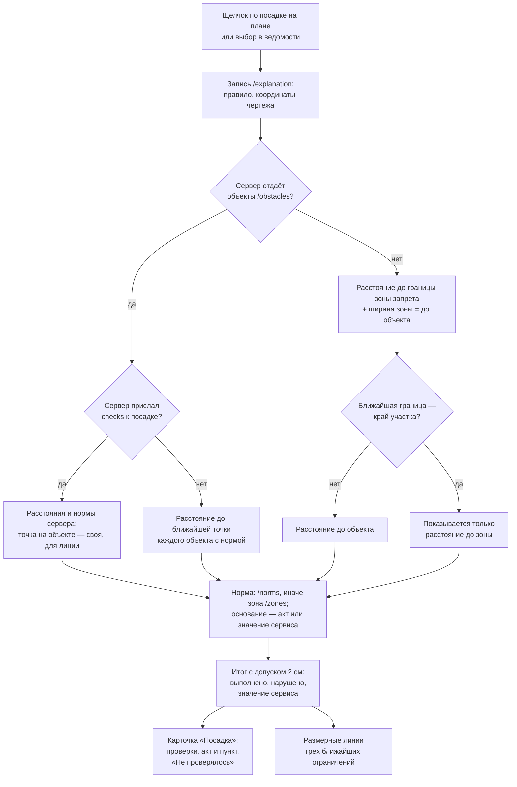

# Интерпретируемость: объяснение к каждой посадке

Сервер решает, где сажать, и присылает для каждой посадки правило посадки и зоны запрета, по которым решение принято. Клиент превращает это в объяснение, которое можно проверить глазами. На плане видно, от чего отступает посадка и на сколько. В карточке — какая норма, из какого акта и пункта и выполнена ли она. Отдельно клиент честно показывает, что не проверялось.

Этот раздел описывает, как объяснение строится на стороне интерфейса. Сам расчёт отступов делает сервер; его описание — в документации сервера.

## Что видит эксперт

Щелчок по посадке открывает карточку «Посадка» (`pages/project/ui/planting-panel.tsx`). Сверху вниз:

1. **Заголовок** — порода (если сервер отдаёт породы) или «Дерево» / «Кустарник».
2. **Правило посадки** из `/explanation` — например, «Рядовая/аллейная посадка вдоль борта» — и идентификатор посадки.
3. **«Почему эта порода»** — причина выбора, крона, высота, источник; только если сервер отдаёт породы.
4. **«Проверки».** Каждая проверка — отдельный пункт:
   - иконка итога;
   - объект, например «Силовой кабель»;
   - фактическое расстояние и норма: «2,3 м при норме не менее 2 м»;
   - акт и пункт: «ПП Москвы от 10.09.2002 № 743-ПП, прил. 1, п. 3.6.3, табл. 3.6.1, строка „силовой кабель и кабель связи“».

   Список отсортирован от самого напряжённого ограничения. Для трёх ближайших на плане рисуются размерные линии; наведение на пункт выделяет его линию.

5. **«Не проверялось»** — объекты чертежа, для которых у сервиса нет нормы.
6. **«Граница участка в чертеже не найдена»** — если сервер не нашёл границу участка и размещал посадки по всему газону.
7. **Координаты** — широта и долгота, если план на карте города, и координаты чертежа.

Те же проверки есть у отклонённых мест — мест, где сервис не стал сажать (возможность `rejected`). Там показываются непройденные проверки. Те же данные входят в отчёт для согласования: разделы «Применённые нормы», «Проверки по посадкам» и «Что не проверялось».

## Процесс

PNG для печати: [images/interpretability-process.png](images/interpretability-process.png).

## Откуда берутся нормы

Норма — минимальное расстояние от объекта до посадки для дерева или кустарника. Клиент берёт её у сервера из одного из двух мест.

- **Зоны запрета `/zones`.** Сервер строит зону запрета как буфер вокруг объектов одной категории на расстояние нормы и обрезает её допустимой областью: газон, пересечённый с границей участка (`../backend/greenplan/zoning/engine.py:131-150`). В каждой зоне записаны категория и подтип объекта, тип посадки, норма в метрах (`distance_m`) и строка нормы (`citation`, например «743-ПП — газопровод»). Этот источник есть всегда.
- **Справочник норм `/norms`** (возможность `norms`). У записи есть акт, пункт (`clause`), текст нормы, ссылка на первоисточник и основание (`basis`):
  - `regulation` — требование акта;
  - `service_default` — консервативное значение сервиса там, где акт норму не устанавливает.

Когда `/norms` нет, основание нормы клиент определяет по сверенной таблице `contracts/norms-verified.md`. Эта таблица встроена в код (`entities/project/lib/norm-basis.ts`) и применяется, только если значение сервиса совпадает с первоисточником. Другое число таблица не подтверждает, и тогда основание не показывается вовсе.

## Как считается фактическое расстояние

Все расчёты идут в метрах: у проекта без геопривязки — в метрах чертежа, у проекта с геопривязкой — в локальной плоскости от центра участка. Ручная привязка к карте на расчёты не влияет ([georeference.md](georeference.md#привязка-проекта)).

### Если сервер отдаёт объекты подосновы

С возможностью `obstacles` клиент знает геометрию каждого объекта: линии сетей, контуры зданий, бортовой камень (`entities/project/lib/obstacle-checks.ts`).

- Для каждого подтипа объекта, у которого есть норма, находится ближайший объект этого подтипа. Поиск идёт в пределах тройной наибольшей нормы для типа посадки.
- Расстояние считается до ближайшей точки его геометрии. Внутри здания оно равно нулю.
- Если сервер прислал к посадке собственные проверки (`checks` в `/explanation`, возможность `explanationChecks`), первичны они: список, расстояния и нормы — сервера. Свой расчёт даёт только точку на объекте для размерной линии.

### Если объектов нет

На задеплоенном сервере `/obstacles` пока нет. Тогда у клиента есть только зоны запрета — буферы на ширину нормы (`entities/project/lib/planting-checks.ts`). Расстояние до объекта восстанавливается так:

> **до объекта = запас до границы зоны + ширина зоны (норма)**

Это верно, только если ближайшая к посадке граница зоны — граница буфера. Сервер обрезает буферы краем допустимой области. Если ближайшая граница — этот срез, до самого объекта может быть сколько угодно больше: его геометрии у клиента нет. В этом случае клиент не выдумывает число и показывает только запас до зоны («до границы зоны»). Срез узнаётся по тому, что ближайшая граница зоны лежит на границе допустимой области.

Если посадка стоит внутри зоны запрета, это дефект данных, и так и показывается.

### Допуск 2 см

Расстояние считается нарушением нормы, если оно меньше нормы больше чем на 2 см (`TOLERANCE_M = 0.02`, `entities/project/lib/planting-checks.ts:90`). Это не послабление нормы, а точность сравнения двух расчётов:

- точки после перепроекции сервером (UTM → WGS84) и проекции клиента совпадают с точностью до сантиметров;
- граница буфера у сервера — многоугольник, вписанный в окружность, и посадка вплотную к зоне стоит ближе нормы на миллиметры (`../backend/greenplan/zoning/engine.py:131`).

На данных «Олимпийского» с сервера (7784 посадки) одна посадка стоит на 2 мм за кромкой зоны — это округление координат при выгрузке, а не нарушение (замер записан в `planting-checks.ts` у проверки «внутри зоны»). Без допуска она выглядела бы нарушением.

## Норма акта и значение сервиса

В таблице 3.6.1 приложения 1 к ПП Москвы № 743-ПП для кустарника у газопровода, водопровода, дренажа и канализации стоит прочерк: норма не установлена. Сервис всё равно держит отступ — консервативное значение. Карточка показывает эти случаи по-разному:

| Основание        | Строка в карточке                                                                                                                                                      | Иконка                                                      |
| ---------------- | ---------------------------------------------------------------------------------------------------------------------------------------------------------------------- | ----------------------------------------------------------- |
| Норма акта       | «2,5 м при норме не менее 1,5 м» и ссылка на акт и пункт                                                                                                               | «выполнено» или «нарушено»                                  |
| Значение сервиса | «при отступе не менее 1,5 м» и строка «Отступ 1,5 м — консервативное значение сервиса. Для кустарника у газопровода норма в ПП № 743-ПП, табл. 3.6.1, не установлена.» | нейтральная «Значение сервиса» или «Отступ сервиса нарушен» |

У значения сервиса пункт акта не показывается никогда: показать пункт рядом с числом, которого в пункте нет, значило бы приписать акту чужую норму.

## Примечание 1 к таблице 3.6.1

Нормы таблицы 3.6.1 даны для деревьев с кроной не больше 5 м. Для более крупных расстояния по примечанию 1 увеличивают, но на сколько — акт не говорит.

Поэтому своего увеличенного значения клиент не вводит. Если у породы дерева крона больше 5 м (`NOTE_1_CROWN_LIMIT_M`, `entities/project/lib/norm-basis.ts`), к проверке по норме акта добавляется строка: «Крона породы больше 5 м — по примечанию 1 к табл. 3.6.1 отступ следует увеличить». Породу знает только сервер с возможностью `species`.

## Как привязываются акты и пункты

Нормы сервиса сверены с первоисточниками в `contracts/norms-verified.md` (сверка 27.09.2026). Для каждой нормы там указаны:

- идентификатор, объект;
- пункт, таблица и строка;
- значение по первоисточнику и в сервисе;
- совпадает ли оно;
- можно ли показывать пункт для дерева и кустарника.

| Норма                  | Объект                         | Пункт                                  | Первоисточник, дерево / кустарник | Сервис    |
| ---------------------- | ------------------------------ | -------------------------------------- | --------------------------------- | --------- |
| `743-pp-gas`           | газопровод                     | п. 3.6.3, табл. 3.6.1                  | 1,5 / –                           | 1,5 / 1,5 |
| `743-pp-heat`          | тепловая сеть                  | п. 3.6.3, табл. 3.6.1                  | 2,0 / 1,0                         | 2,0 / 1,0 |
| `743-pp-water`         | водопровод                     | п. 3.6.3, табл. 3.6.1                  | 2,0 / –                           | 2,0 / 2,0 |
| `743-pp-drainage`      | дренаж                         | п. 3.6.3, табл. 3.6.1                  | 2,0 / –                           | 2,0 / 2,0 |
| `743-pp-sewer`         | канализация, водосток          | п. 3.6.3, табл. 3.6.1                  | 1,5 / –                           | 1,5 / 1,5 |
| `743-pp-power-cable`   | силовой кабель                 | п. 3.6.3, табл. 3.6.1                  | 2,0 / 0,7                         | 2,0 / 0,7 |
| `743-pp-comm-cable`    | кабель связи                   | п. 3.6.3, табл. 3.6.1                  | 2,0 / 0,7                         | 2,0 / 0,7 |
| `743-pp-other-utility` | неопознанная сеть              | строки нет                             | —                                 | 2,0 / 2,0 |
| `743-pp-road-edge`     | край тротуара, бортовой камень | п. 3.6.3, табл. 3.6.1                  | 0,7 / 0,5                         | 0,7 / 0,5 |
| `743-pp-existing-tree` | существующее дерево            | п. 3.6.4, табл. 3.6.2 (ориентировочно) | 5–6 / –                           | 5,0 / 1,5 |

Прочерк «–» значит «не нормируется». Акт во всех строках — ПП Москвы от 10.09.2002 № 743-ПП, приложение 1. Первоисточники:

- ПП Москвы № 743-ПП, приложение 1 — <https://base.garant.ru/378956/53f89421bbdaf741eb2d1ecc4ddb4c33/>;
- СП 42.13330.2016, п. 9.6, табл. 9.1 — те же значения; копия: <https://tiflocentre.ru/documents/sp42-13330-2016.php>;
- ПП Москвы № 623-ПП (МГСН 1.02-02), п. 4.2.4 — своих чисел нет, отсылка к МГСН 1.01-99: <https://base.garant.ru/378830/f9b0119a4fce7561a213cdc9af189098/>.

Замечания к нормам сервиса, которые требуют решения на стороне сервера (бортовой камень, существующее дерево, способ измерения), — в `contracts/norms-verified.md` и в [limitations.md](limitations.md#нормы).

## Что показывается как «не проверялось»

Клиент не умалчивает о том, чего не проверял.

- **Объекты без нормы в сервисе.** Сервер отдаёт их списком (`uncovered_categories` в `/zones`): например здания и сооружения, опоры и мачты, красные линии, подпорные стенки, колодцы и люки. В карточке посадки — строка «Отступы не проверялись для объектов: …». В отчёте — раздел «Что не проверялось».
- **Нормы первоисточника, которых нет в сервисе:**
  - наружная стена здания — 5,0 / 1,5 м;
  - стена школы и детского сада — 10,0 / 1,5 м;
  - край проезжей части — 2,0 / 1,0 м;
  - ось трамвайных путей — 5,0 / 3,0 м;
  - мачта и опора освещения — 4,0 м для дерева;
  - подошва откоса — 1,0 / 0,5 м;
  - подпорная стенка — 3,0 / 1,0 м.

  Они перечислены в отчёте таблицей: отступ от этих объектов не проверялся.

- **Граница участка.** Если сервер не нашёл в чертеже границу участка (`used_site_boundary` ложно), карточка говорит об этом прямо: посадки размещены по всему газону.
- **Правленые посадки.** Серверное объяснение описывает исходную точку. У перемещённой или добавленной посадки проверки считает клиент по новой точке, серверные числа к ней не применяются.

## Размерные линии

Линии рисуются для трёх ближайших ограничений выбранной посадки (`MAX_DIMENSIONS = 3`, `entities/project/lib/dimension-lines.ts`).

- **Есть объекты.** Один отрезок от ствола до ближайшей точки объекта с подписью фактического расстояния. Если норма меньше факта, на том же отрезке поперечный штрих на расстоянии нормы и подпись «норма 1,5 м».
- **Объектов нет.**
  - «Запас» — сплошная линия от ствола до края зоны запрета.
  - «Охранная зона» — пунктир от края зоны до объекта, длиной в норму.
  - Если граница — срез краем участка, рисуется только запас.

Подписи длины появляются, когда в метре карты не меньше 6 пикселей, и не ложатся на крону.
