# Работа с интерфейсом

Экраны — в порядке основного сценария: от загрузки подосновы до отчёта и привязки к карте. Снимки сделаны в режиме «Демо» при размере окна 1440 × 900.

Шапка есть на всех экранах:

- разделы «Проекты», «Геопривязка», «Новый проект»;
- переключатель «Сервер» / «Демо», если демо разрешено в `config.json`;
- в «Демо» под шапкой — метка «Демонстрационные данные».

## Список проектов

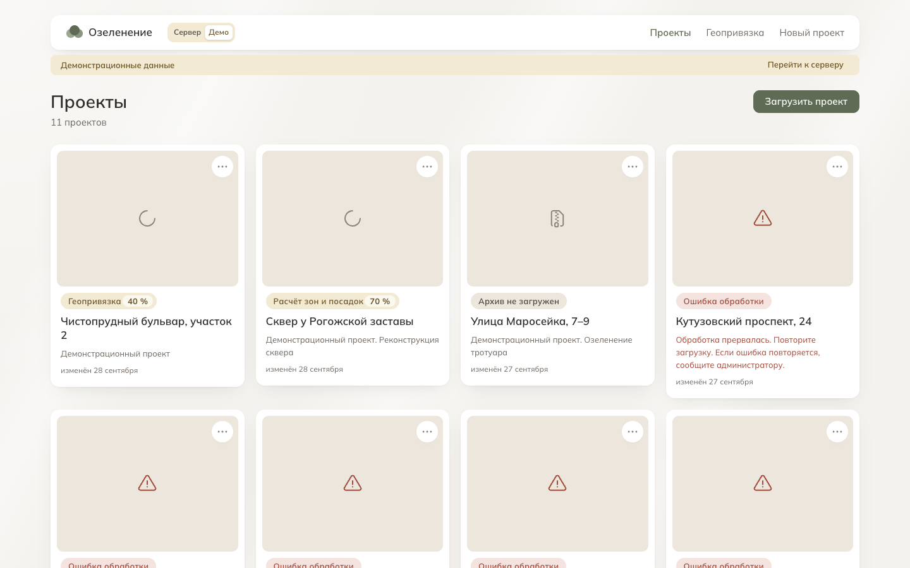

Карточки проектов, по умолчанию — изменённые недавно сверху. Над ними — поиск по названию, состояние обработки («Все», «Готово», «Обработка», «Ошибка», «Без архива» — со счётчиками) и сортировка: по дате изменения, по названию, «Сначала проблемные». Фильтр записывается в адрес страницы: ссылкой можно поделиться, «Назад» возвращает прежний фильтр. Если под фильтр не подошёл ни один проект — «Ничего не нашлось» и «Сбросить фильтры».

У каждой карточки — превью плана, статус обработки и её длительность, название и описание. Пока в списке есть идущие обработки, он обновляется сам. Меню «…» на карточке — загрузить архив в черновик, выбрать главный чертёж, удалить проект. «Загрузить проект» открывает мастер.

## Мастер загрузки

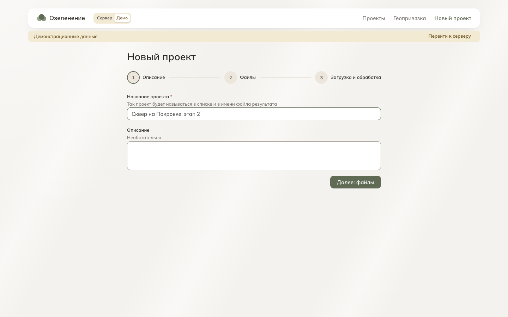

Мастер состоит из трёх шагов:

1. **«Описание»** — название и описание проекта.
2. **«Файлы»** — один ZIP с подосновой или несколько DXF, которые браузер упакует в ZIP сам. Архив проверяется до отправки: сигнатура, наличие DXF, размер до 100 МиБ, имена файлов. Сводка показывает, что будет отправлено.
3. **«Загрузка и обработка»** — прогресс отправки, затем этапы обработки.

Если сервер требует область участка, между описанием и файлами появляется шаг «Участок»: область задаётся рамкой на карте или координатами углов.

Над картой шага — поле «Найти место на карте». То же поле — над картой раздела «Геопривязка».

- **Координаты** разбираются в браузере и работают всегда: `55.7558, 37.6173`, `55,7558 37,6173`, `55°45′21″ 37°37′02″`, с буквами полушарий N, S, E, W или С, Ю, В, З. Порядок — широта, потом долгота; буквы полушарий позволяют написать долготу первой.
- **Адрес** ищется, только если в `config.json` задан `geocoder` (API Nominatim). Поиск идёт по Enter или кнопке, не на каждое нажатие клавиши. Результаты — списком, выбор стрелками и Enter; карта вписывает охват найденного объекта. Под списком — подпись источника. Места за охватом карты Москвы в список не попадают; на координаты за ним поле отвечает ошибкой: карта туда не уходит.
- Без `geocoder` в поле подсказка «Координаты, например 55.7558, 37.6173», а на адрес — объяснение, что поиск по адресу не настроен.

Уход из мастера до того, как сервер принял архив, удаляет созданный проект.

## Обработка

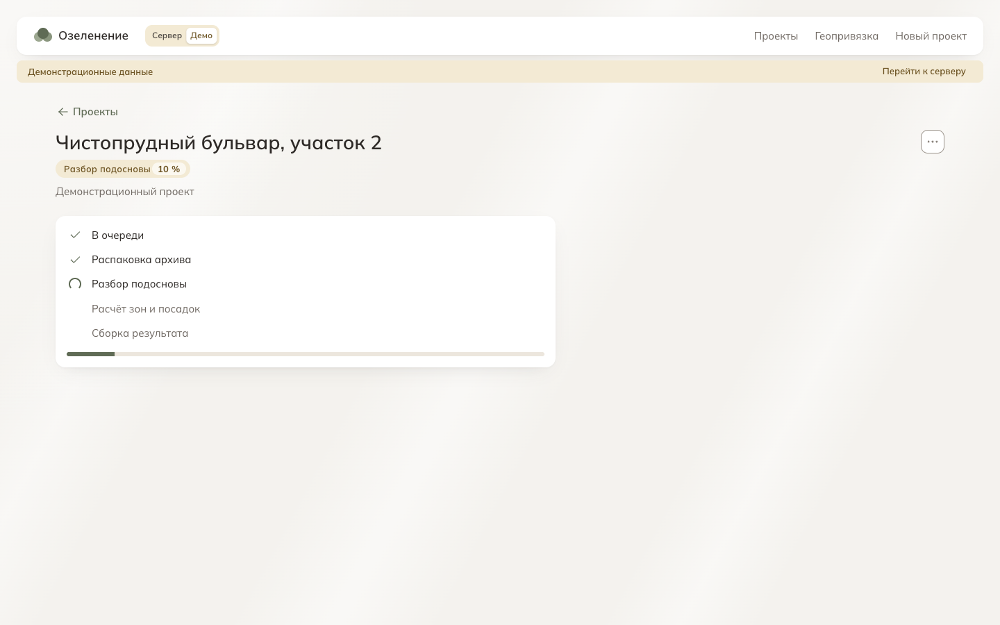

Экран проекта во время обработки показывает этапы сервера: очередь, распаковка архива, разбор подосновы, геопривязка, расчёт зон и посадок, сборка результата. Текущий этап и процент — в бейдже, смена этапа объявляется скринридеру. Если обработка идёт дольше 30 минут, опрос останавливается, и появляется «Проверить снова».

Ошибка обработки показывается с объяснением и действием. Например, при повреждённом архиве — «Загрузить другой архив». Если главных чертежей несколько — выбор главного чертежа.

## План проекта

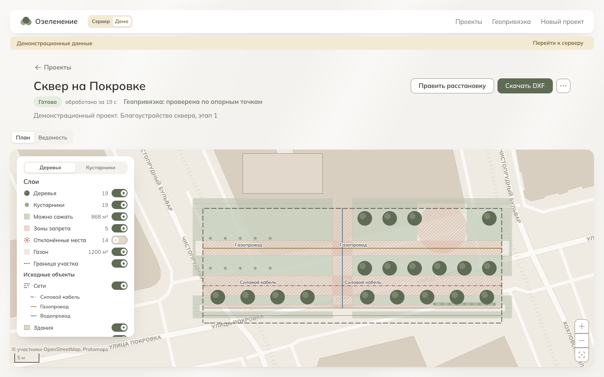

План посадок на карте города или, без геопривязки, в координатах чертежа.

- **Шапка.** Статус, длительность обработки, способ геопривязки (по щелчку — невязки опорных точек), «Править расстановку», «Скачать DXF», меню «…».
- **Панель «Слои»:**
  - переключатель «Деревья» / «Кустарники» для зон «можно» и «нельзя»;
  - слои результата со счётчиками и площадями;
  - исходные объекты подосновы с условными знаками сетей;
  - подложка;
  - поиск посадки по номеру.
- **Выбор подложки** — в правом нижнем углу карты, над кнопками масштаба. Тот же переключатель стоит на шаге «Участок» мастера и в разделе «Геопривязка»:
  - «Схема» — своя подложка PMTiles в палитре продукта;
  - «Светлая» — тот же файл в белой палитре Protomaps: план читается на нейтральном фоне;
  - «Снимок» и «Снимок с подписями» — только если космоснимок включён в `config.json`.

  Выбор общий для всех карт и помнится до закрытия вкладки. Подпись об источнике в углу карты меняется вместе с подложкой. Без WebGL переключателя нет.

- **Выбор на карте.** Щелчок по объекту карты открывает его панель: «Посадка», «Зона запрета», «Объект», «Газон» или «Отклонённое место». Esc закрывает панель.

## Посадка: проверки и размерные линии

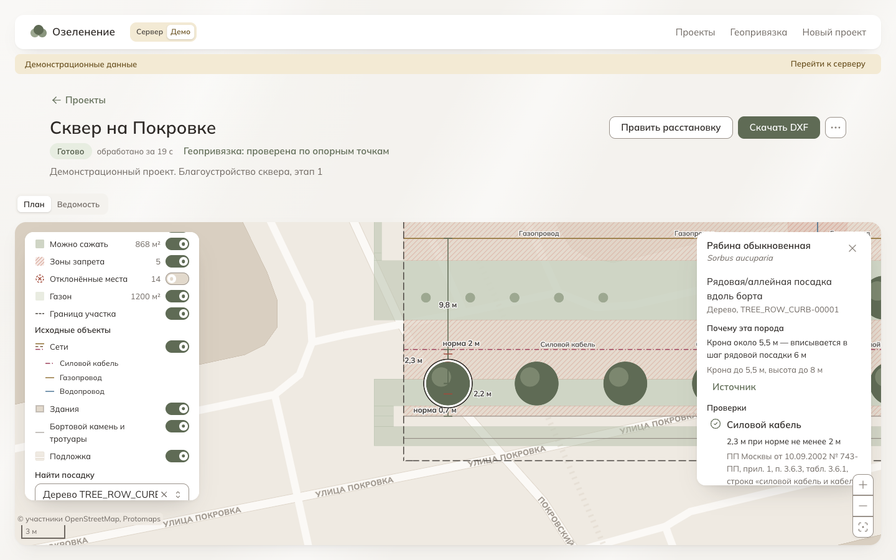

Карточка посадки:

- порода и правило посадки;
- «Почему эта порода»;
- «Проверки» — у каждой объект, фактическое расстояние, норма, акт и пункт;
- «Не проверялось»;
- координаты с кнопкой «Скопировать».

На плане — размерные линии трёх ближайших ограничений: фактическое расстояние до объекта и штрих нормы на том же отрезке. Наведение на пункт проверки выделяет его линию. Как строится объяснение — в [interpretability.md](interpretability.md).

## Правка расстановки

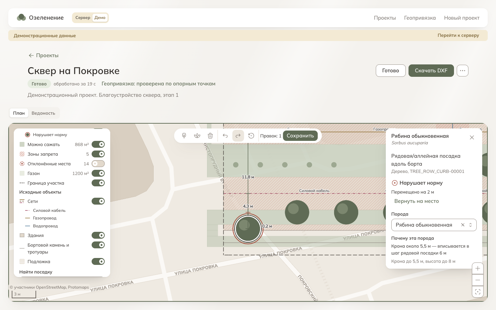

«Править расстановку» открывает панель правки над картой:

- добавить дерево или кустарник, удалить выбранную;
- отменить, повторить, сбросить к расстановке сервиса;
- счётчик правок: «Правок нет» или «Правок: 3»;
- «Сохранить» — если сервер хранит версии плана посадок; иначе — «Черновик в этом браузере».

Когда правки есть, а сервер не отдаёт DXF с правками, «Скачать DXF» открывает меню: «Результат с правками (DXF)» — чертёж сервера, где слой результата заменён итоговой расстановкой, «Результат сервиса (DXF)» и «Только слой посадок (DXF)».

Посадку тянут мышью или двигают стрелками. У правленой посадки сразу пересчитывается статус. На снимке дерево сдвинуто на 2 м к бортовому камню: карточка показывает «Нарушает норму», «Перемещено на 2 м» и «Вернуть на место», а на плане — кольцо статуса. Подробно — в [editing-and-export.md](editing-and-export.md).

### Версии плана посадок

Когда сервер хранит версии (возможность `plantingEdits`), «Сохранить» открывает диалог «Сохранить правки» с необязательным именем. Правки становятся новой версией, и она сразу открывается на экране. DXF новой версии сервер собирает несколько секунд: с возможностью `editedDxf` «Скачать DXF» дождётся файла сам. В шапке проекта — «Версия:» со списком: «1 — расстановка сервиса», «2 — правки 28 сентября, 14:30 (имя)». План, ведомость, отчёт и «Скачать DXF» — по выбранной версии. В режиме правки и с несохранёнными правками версию не сменить: смена стёрла бы правки.

## Ведомость

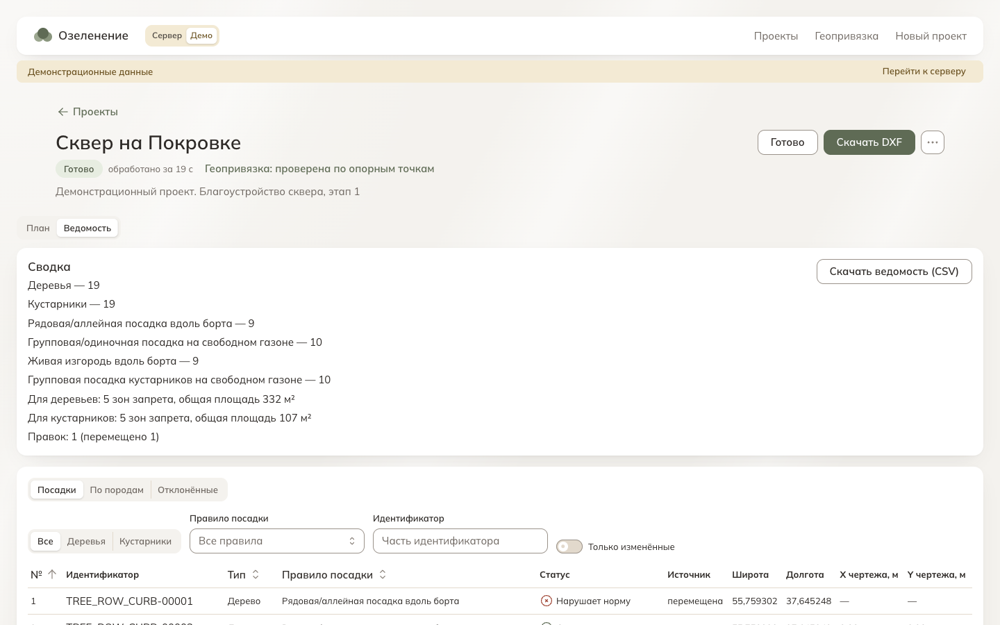

Вид «Ведомость» рядом с планом:

- сводка по типам посадок, правилам и зонам запрета, меню «Скачать ведомость»: Excel (.xlsx) и CSV;
- таблица посадок с фильтрами, сортировкой и страницами; с правками — колонки «Статус» и «Источник» и фильтр «Только изменённые»;
- «По породам» — ведомость озеленения;
- «Отклонённые» — места, где сервис не стал сажать.

Строка таблицы ведёт к посадке на плане.

## Отчёт для согласования

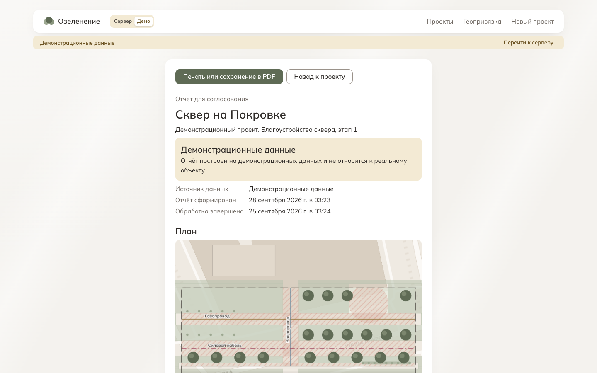

Меню «…» → «Отчёт для согласования» — страница, которую браузер печатает или сохраняет в PDF. Разделы:

- план с масштабом и условными знаками;
- сводка;
- ведомость озеленения;
- применённые нормы;
- проверки по посадкам;
- что не проверялось;
- геопривязка.

Отчёт из «Демо» помечен крупной плашкой «Демонстрационные данные».

## Модуль геопривязки

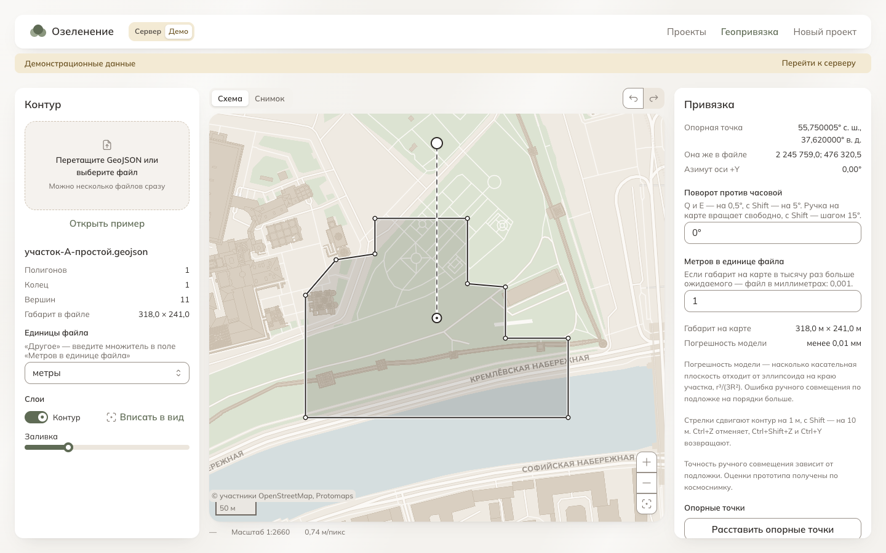

Раздел «Геопривязка» — совмещение контура участка с картой:

- **слева** — контур, его единицы, слои и эталоны;
- **в центре** — карта с выбором подложки, как на плане проекта;
- **справа** — параметры привязки, опорные точки с оценкой точности, сравнение с эталонами и выгрузка.

Контур тянут мышью и поворачивают за ручку. Опорные точки ставят парами: точка контура, затем её место на карте. Подробно — в [georeference.md](georeference.md).

## Привязка проекта к карте

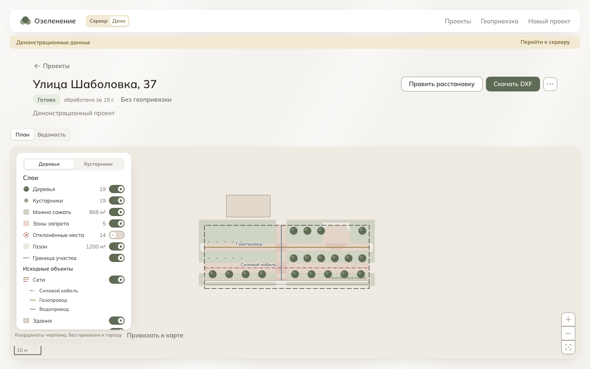

Проект без геопривязки сервера показан в координатах чертежа, без подложки, с подписью в углу карты «Координаты чертежа, без привязки к городу».

Привязать проект к карте — цель следующей версии: применить привязку может только сервер, а серверная часть ещё не готова. На стенде «Сервер» кнопок привязки на экране проекта нет; модуль открыт в меню «Геопривязка». В «Демо» функция показана как цель: в подписи карты есть «Привязать к карте», тот же пункт — в меню проекта.

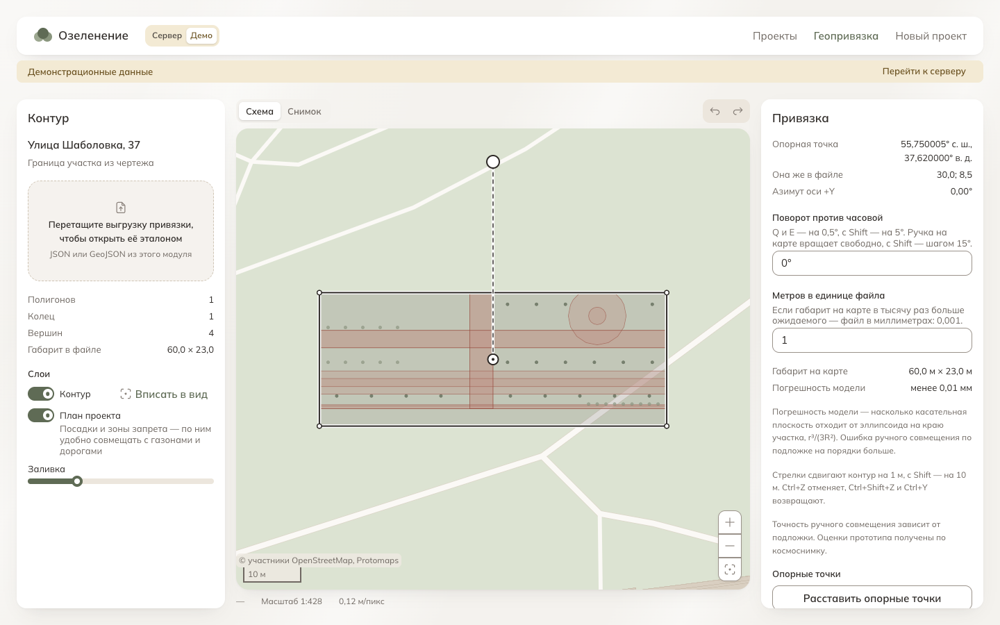

Модуль открывается в режиме проекта:

- контур — граница участка из результата;
- под ним полупрозрачно — посадки и зоны запрета проекта;
- внизу панели «Привязка» — «Применить к проекту» и «Отмена».

На снимке контур поставлен в начальное положение, без совмещения.

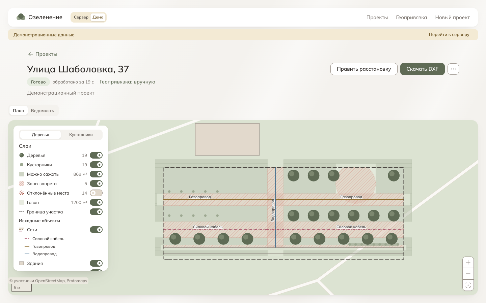

После «Применить к проекту» привязка уходит на сервер, и проект обрабатывается заново. Данные приходят от сервера уже в WGS84, и план ложится на карту города. В шапке — «Геопривязка: вручную» или «по опорным точкам, RMS …». Параметров привязки сервер не возвращает, поэтому изменить или снять её из интерфейса нельзя.

Снимки сделаны в «Демо».

## Проект, упавший на геопривязке

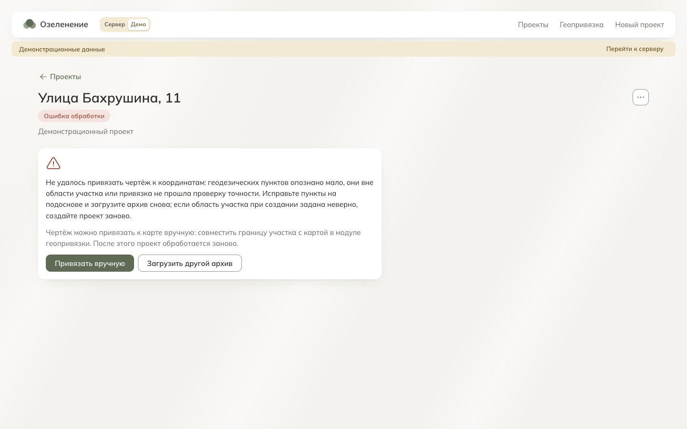

Если серверу не удалось привязать чертёж — пунктов мало или каталог недоступен, — проект считается сломанным: геопривязка обязательна. Привязать его вручную — тоже цель следующей версии. В «Демо» в карточке ошибки есть «Привязать вручную». Модуль открывается с границей участка из подосновы. Если сервер объекты подосновы не отдаёт, граница в них не найдена или не замкнута, модуль называет причину и просит загрузить границу файлом. После «Применить к проекту» проект обрабатывается заново уже с этой привязкой.
